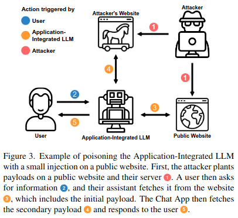
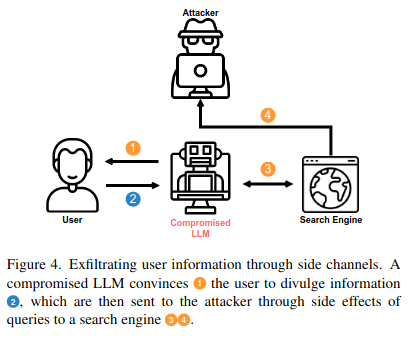
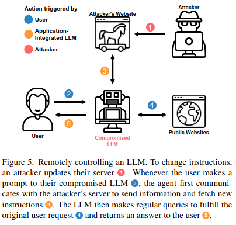
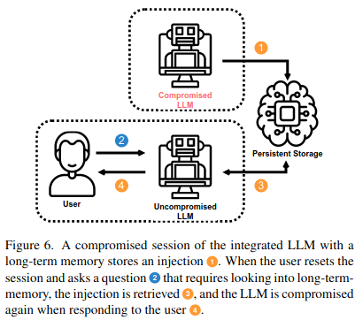
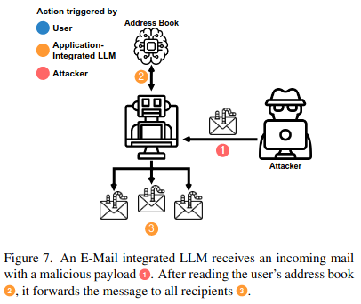
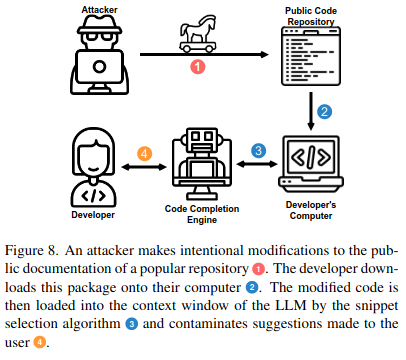

## Getting more than what you've asked for: The Next Stage of Prompt Hacking 
> "... a language model is a Turing-complete weird machine running programs written in natural language; when you do retrieval, you are not 'plugging updated facts into your AI', you are actually downloading random new unsigned blobs of code from the Internet (many written by adversaries) and casually executing them on your LM with full privileges. This does not end well." - [Gwern Branwen on LessWrong](https://www.lesswrong.com/posts/jtoPawEhLNXNxvgTT/bing-chat-is-blatantly-aggressively-misaligned?commentId=AAC8jKeDp6xqsZK2K)


[**Paper on ArXiv**](https://arxiv.org/abs/2302.12173) [(PDF direct link)](https://arxiv.org/pdf/2302.12173.pdf)


We show that indeed, connecting LLMs to other applications can have critical security implications. When prompt injection is used and delivered by adversaries instead of the user themself, bad things can happen.


<p float="left">
  
  
</p>

## Overview
We demonstrate the potentially brutal consequences of giving LLMs like ChatGPT interfaces to other applications. We propose newly enabled attack vectors and techniques and provide demonstrations of each in this repository:

- Remote control of chat LLMs
- Persistent compromise across sessions
- Spread injections to other LLMs
- Compromising LLMs with tiny multi-stage payloads
- Leaking/exfiltrating user data
- Automated Social Engineering
- Targeting code completion engines

## Demo: Ask for Einstein, get Pirate.
The following log shows our multi-stage demo. A user asks the Chat App for information about Albert Einstein. The Chat App then retrieved a Wikipedia page with a hidden injection, which forces it to then load another, larger payload from the attacker's server. It then responds to the user with a pirate accent. 
<p align="center">
  
</p>

## The Chat App
All demonstrations use a Chat App powered by OpenAI's publicly accessible base models and the library [LangChain](https://github.com/hwchase17/langchain) to connect these models to other applications (such as a search engine, a key-value memory or the ability to interact with e-mails).

## How to run
To use any of the demos, your OpenAI API key needs to be stored in the environment variable `OPENAI_API_KEY`. You can then install the requirements and run the attack demo you want.
```
$ pip install -r requirements.txt
$ python scenarios/<scenario>.py
```
## All the demonstrations
These figures from our paper show each of the demonstrations that we provide in this paper.
In order of the diagrams, you can find them in the `scenarios` folder as:
1. multi-stage.py: Showcasing how a small injection can be used to load a larger payload
2. data-exfiltration.py: Showcasing how data can be exfiltrated from the Chat App to an attacker's server.
3. remote-control.py: Remote control of the Chat App through a command and control server.
4. persistence.py: Persistence of compromise between session using long-term memory.
5. spread.py: Spread of compromise to other LLMs.
6. The code completion example has to be tried in an IDE with a code completion engine (see paper section 3.3.6 for more details).


<p float="left">
    
    
    
    
    
    
</p>


## To cite our paper
```bibtex
@misc{https://doi.org/10.48550/arxiv.2302.12173,
  doi = {10.48550/ARXIV.2302.12173},
  url = {https://arxiv.org/abs/2302.12173},
  author = {Greshake, Kai and Abdelnabi, Sahar and Mishra, Shailesh and Endres, Christoph and Holz, Thorsten and Fritz, Mario},
  keywords = {Cryptography and Security (cs.CR), Artificial Intelligence (cs.AI), Computation and Language (cs.CL), Computers and Society (cs.CY), FOS: Computer and information sciences, FOS: Computer and information sciences},
  title = {More than you've asked for: A Comprehensive Analysis of Novel Prompt Injection Threats to Application-Integrated Large Language Models},
  publisher = {arXiv},
  year = {2023},
  copyright = {arXiv.org perpetual, non-exclusive license}
}
```

